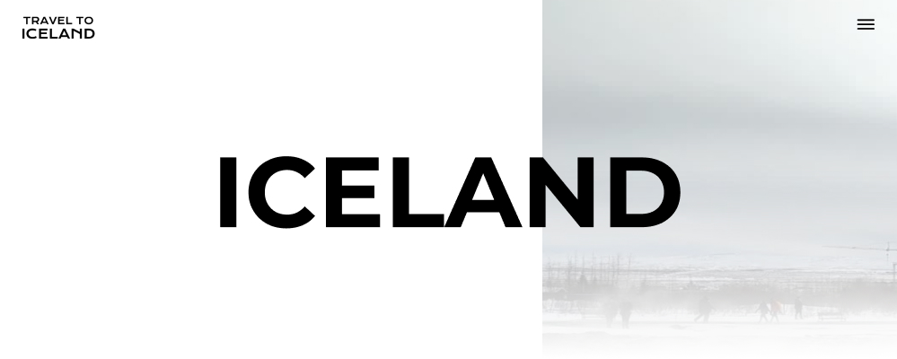

# Iceland
Animated navigation exercise with HTML, SCSS and pure Javascript.



### Prerequisites

* No frameworks or libraries used for this project.

## 🖊️ Notes
### 🎨 Defined styles
The structure is 100% responsive.</br>
Created 3 different stylesheets with SASS:
- `main.scss` For all custom styles
- `_base.scss` To define style variables and mixin functions for responsive breakpoints
- `_animations.scss` To define the element's animations

Responsive Breakpoints mixins:
```
@mixin until-tablet {
  @media (min-width: 0) and (max-width: #{$tablet-width - 1px}) {
    @content;
  }
}

@mixin tablet {
  @media (min-width: #{$tablet-width}) and (max-width: #{$desktop-width - 1px}) {
    @content;
  }
}

@mixin from-tablet {
  @media (min-width: #{$tablet-width}) {
    @content;
  }
}

@mixin desktop {
  @media (min-width: #{$desktop-width}) {
    @content;
  }
}
```
### 💫 JS animations
Pure js helps the web run faster without having any framework dependency.

The menu opens an animated top layer with css classes that are activated and deactivated by js through different functions:

```
  function toggleClassesOnCloseMenu(element, classIn, classOut) {
    element.classList.remove(classIn);
    element.classList.add(classOut);
  }

  function toggleClassesOnOpenMenu(element, classIn, classOut) {
    if(element.classList.contains(classOut)) {
      element.classList.remove(classOut);
    }
    element.classList.add(classIn);
  }
```

It is a simple and functional project, using SASS to make it easier to scale in the future.


And that's all :) Thank you for watching it! 👋
